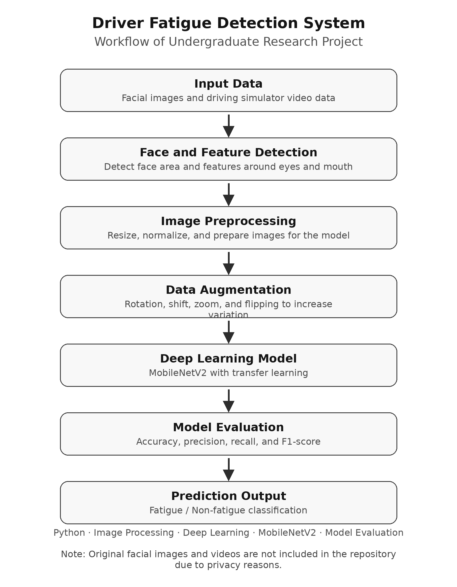

# Driver Fatigue Detection System Using Facial Features

## Overview

This repository summarizes my undergraduate research project on driver fatigue detection using facial images and deep learning.

The goal of this project was to detect whether a driver is in a fatigued state by analyzing facial features, especially around the eyes and mouth.

This project was conducted as an academic research project. Due to privacy reasons, the original facial images and videos are not included in this repository.

## Background

Driver fatigue is one of the factors related to traffic accidents. Since facial expressions and eye conditions can change when a person becomes tired, I tried to build an image-based fatigue detection system using image processing and deep learning.

Through this project, I wanted to understand not only how to train a model, but also how preprocessing, data preparation, and evaluation affect the final result.

## My Role

I worked on the main parts of the project, including:

* Image preprocessing
* Data augmentation
* Model training
* Model evaluation
* Result analysis

I also checked prediction errors and considered possible reasons, such as image quality, face direction, and differences between individuals.

## Method

The project used facial image data and video data collected in a driving simulator environment.

The basic workflow was:

1. Detect facial areas and facial features
2. Preprocess the images
3. Apply data augmentation
4. Train a deep learning model
5. Evaluate the model using several metrics



For the deep learning model, I used MobileNetV2 with transfer learning. I evaluated the model using accuracy, precision, recall, and F1-score.

## Result

The final model achieved about 90% accuracy on the test data.

Through the evaluation, I learned that the performance of an AI model depends not only on the model architecture, but also on the quality of the dataset, preprocessing method, augmentation strategy, and evaluation method.

## What I Learned

Through this project, I learned that the performance of a deep learning model depends not only on the model architecture, but also on the quality of the data, preprocessing, data augmentation, and evaluation method.

I also gained basic experience in handling image data with Python, training a deep learning model, and evaluating the result using metrics such as accuracy, precision, recall, and F1-score.

One difficulty was that facial direction, lighting conditions, and individual differences could affect the prediction result. This made me realize the importance of checking the data carefully and analyzing the failure cases, instead of only looking at the final accuracy.

## Repository Structure

```text
driver-fatigue-detection/
├── README.md
├── figures/
├── src/
├── requirements.txt
└── .gitignore
```

At this stage, this repository mainly contains the project summary. Source code and figures may be added later after removing private or sensitive information.

## Notes

The original facial image and video data are not included because they may contain personal information.

This repository is intended to show the project background, method, workflow, and learning outcomes.

## Keywords

Python, Image Processing, Deep Learning, MobileNetV2, Data Augmentation, Model Evaluation, Driver Fatigue Detection
